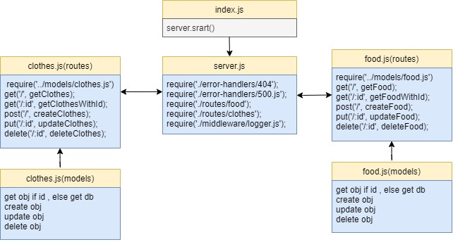

# basic-api-server
# basic-express-server

Nour Abu El-Enein

401 class 02 lab
# LAB - 02
## server-deployment-practice
### Author: Nour Abu El-Enein

- [ci/cd](https://github.com/engnour94/basic-api-server/actions) (GitHub Actions)

- [Repo link](https://github.com/engnour94/basic-api-server)

- [main Deployed heroku](https://dashboard.heroku.com/apps/basic-api-server-by-nour/deploy/github)
 
### Setup

#### `.env` requirements

- `PORT` - 3000

#### Running the app

- `npm start`
-  `npm i` : to install the required dependencies
- `npm i -D`: to install the required devDependencies

- Endpoint: `/`
  - Returns message

    ```

    ''welcome to server.js';

   

    ```
- **Endpoint for food:** 
  - /api/v1/food
  - /api/v1/food/:id

- **Endpoint for clothes:** 
   - /api/v1/clothes
  - /api/v1/clothes/:id

    ```
- Endpoint: **anything else ..**
  - Returns an error 404
  - Returns an Object

    ```

  {
    status: 404,
    message: 'page not found something went wrong',
  }

    ```
#### Tests

- Run the command `npm test` to test and verify the server and the middlewares are working.
- Run the command `npm run` lint for testing lint.

#### uml



